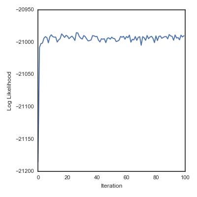
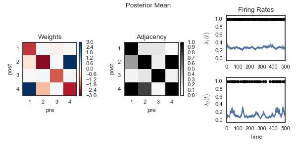

# PyGLM: Bayesian inference for nonlinear autoregressive models of count data

Neural circuits contain heterogeneous groups of neurons that differ in
type, location, connectivity, and basic response properties. However,
traditional methods for dimensionality reduction and clustering are
ill-suited to recovering the structure underlying the organization of
neural circuits. In particular, they do not take advantage of the rich
temporal dependencies in multi-neuron recordings and fail to account
for the noise in neural spike trains. This repository contains tools for
inferring latent structure from simultaneously recorded spike train
data using a hierarchical extension of a multi-neuron point process
model commonly known as the generalized linear model (GLM). In the
statistics and time series analysis communities, these correspond to
nonlinear vector autoregressive processes with count observations.
We combine the GLM with flexible graph-theoretic priors
governing the relationship between latent features and neural
connectivity patterns.  Fully Bayesian inference via \polyagamma
augmentation of the resulting model allows us to classify neurons and
infer latent dimensions of circuit organization from correlated spike
trains.  We demonstrate the effectiveness of our method with
applications to synthetic data and multi-neuron recordings in primate
retina, revealing latent patterns of neural types and locations from
spike trains alone.

# References
Scott W. Linderman, Ryan P. Adams, and Jonathan W. Pillow. Bayesian latent
structure discovery from multi-neuron recordings. _Advances in Neural Information
Processing Systems_, 2016.

Scott W. Linderman. _Bayesian methods for discovering structure in neural spike
trains_. PhD thesis, Harvard University, 2016.

# Example
We provide a number of classes for building and fitting such models.
Let's walk through a simple example
where  we construct a discrete time model with four neurons, as in `examples/synthetic`.
The neurons are connected via a network such that spikes influence
the rate of subsequent spikes on post-synaptic (downstream) neurons.
```python
# Create a simple, sparse network of four neurons
T = 10000   # Number of time bins to generate
N = 4       # Number of neurons
B = 1       # Number of "basis functions"
L = 100     # Autoregressive window of influence

# Create a cosine basis to model smooth influence of
# spikes on one neuron on the later spikes of others.
basis = cosine_basis(B=B, L=L) / L

# Generate some data from a model with self inhibition
true_model = SparseBernoulliGLM(N, basis=basis)

# Generate T time bins of events from the the model
# Y is the generated spike train.
# X is the filtered spike train for inference.
X, Y = true_model.generate(T=T, keep=True)

# Plot the model parameters and data
true_model.plot()
```

You should see something like this:


Now create a test model and try to infer the network given the spike train.
```python
# Create the test model and add the spike train
test_model = SparseBernoulliGLM(N, basis=basis)
test_model.add_data(Y)

# Initialize the plot
_, _, handles = test_model.plot()

# Run a Gibbs sampler
N_samples = 100
lps = []
for itr in xrange(N_samples):
    test_model.resample_model()
    lps.append(test_model.log_likelihood())
    test_model.plot(handles=handles)
```

With interactive plotting enabled, you should see something like:


Finally, we can plot the log likelihood over iterations to assess the
convergence of the sampling algorithm, at least in a heuristic way.

```python
plt.plot(lps)
plt.xlabel("Iteration")
plt.ylabel("Log Likelihood")
```



Looks like it has! Now let's look at the posterior mean of the
network and firing rates.



# Installation
PyGLM requires [pypolyagamma](https://github.com/slinderman/pypolyagamma)
for its Bayesian inference algorithms.  This dependency will automatically
be installed if you do not already have it, but by default, `pip` will not
install the parallel version. If you want to use parallel resampling, look
at the [pypolyagamma](https://github.com/slinderman/pypolyagamma) homepage
for instructions on installing from source with OpenMP.

To install `pyglm` from source, first clone the repo

    git clone git@github.com:slinderman/pyglm.git
    cd pyglm

Then install in developer mode:

    pip install -e .

Or use the standard install:

    python setup.py install

