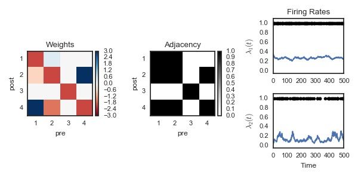

# PyGLM: Bayesian Inference for nonlinear autoregressive models of count data

Neural circuits contain heterogeneous groups of neurons that differ in
type, location, connectivity, and basic response properties. However,
traditional methods for dimensionality reduction and clustering are
ill-suited to recovering the structure underlying the organization of
neural circuits. In particular, they do not take advantage of the rich
temporal dependencies in multi-neuron recordings and fail to account
for the noise in neural spike trains. This repository contains tools for
inferring latent structure from simultaneously recorded spike train
data using a hierarchical extension of a multi-neuron point process
model commonly known as the generalized linear model (GLM). In the
statistics and time series analysis communities, these correspond to
nonlinear vector autoregressive processes with count observations.
We combine the GLM with flexible graph-theoretic priors
governing the relationship between latent features and neural
connectivity patterns.  Fully Bayesian inference via \polyagamma
augmentation of the resulting model allows us to classify neurons and
infer latent dimensions of circuit organization from correlated spike
trains.  We demonstrate the effectiveness of our method with
applications to synthetic data and multi-neuron recordings in primate
retina, revealing latent patterns of neural types and locations from
spike trains alone.

# Example
We provide a number of classes for building and fitting such models.
Let's walk through a simple example
where  we construct a discrete time model with four neurons, as in `examples/synthetic`.
The neurons are connected via a network such that spikes influence
the rate of subsequent spikes on post-synaptic (downstream) neurons.
```python
# Create a simple, sparse network of four neurons
T = 10000   # Number of time bins to generate
N = 4       # Number of neurons
B = 1       # Number of "basis functions"
L = 100     # Autoregressive window of influence

# Create a cosine basis to model smooth influence of
# spikes on one neuron on the later spikes of others.
basis = cosine_basis(B=B, L=L) / L

# Generate some data from a model with self inhibition
true_model = SparseBernoulliGLM(N, basis=basis)

# Generate T time bins of events from the the model
# Y is the generated spike train.
# X is the filtered spike train for inference.
X, Y = true_model.generate(T=T, keep=True)

# Plot the model parameters and data
true_model.plot()
```

You should see something like this:




Now create a test model and try to infer the network given the spike train.
```python
# Create the test model and add the spike train
test_model = SparseBernoulliGLM(N, basis=basis)
test_model.add_data(Y)

# Initialize the plot
_, _, handles = test_model.plot()

# Run a Gibbs sampler
N_samples = 100
lps = []
for itr in xrange(N_samples):
    test_model.resample_model()
    lps.append(test_model.log_likelihood())
    test_model.plot(handles=handles)
```

With interactive plotting enabled, you should see something like:


Finally, we can plot the log likelihood over iterations to assess the
convergence of the sampling algorithm, at least in a heuristic way.

```python
plt.plot(lps)
plt.xlabel("Iteration")
plt.ylabel("Log Likelihood")
```


Looks like it has! Now let's look at the posterior mean of the
network and firing rates.


# Installation

This is a set of instructions for installing PyGLM on OSX.

To install this requires compiling with OpenMP support, but OSX does not come with this support in its default `clang`. Thus you will need to either install `clang-omp` or install GNU `gcc`. The instructions below are for `clang-omp`, but the procedure for using GNU gcc is analogous:

    # install clang with OpenMP support (needed to compile later packages)
    brew update
    brew install clang-omp

Then, `pypolyagamma` is a dependency that requires OpenMP, GSL, and a few other packages included in the `requirements.txt`. To build `pypolyagamma` requires building it with the appropriate C and C++ compiler, which in this case will be `clang-omp` and `clang-omp++`. However, because it also requires other packages, namely `Cython` and `numpy` we will first install the requirements from `requirements.txt`:

    # install other dependencies
    pip install -r requirements.txt

To install `pypolyagamma`, first we will need to install `gsl`, which is a non-python specific dependency: 

    # install gslrandom with OpenMP support
    brew install gsl

Then we can install `pypolyagamma` using `clang-omp` and `clang-omp++` as our `C` and `C++` compilers.

    # Move to directory where you want pypolyagamma installed
    git clone git@github.com:slinderman/pypolyagamma.git
    cd pypolyagamma
    CC=clang-omp CXX=clang-omp++ python setup.py install

Your environment should now be setup properly to either build a development or standard version of PyGLM.  Depending on whether you want to build a development install or a standard install you will need to use one of the two following sets of commands:

    # Go back to the PyGLM directory
    cd pyglm

    # if you want to develop the library, run:
    pip install -e .

    # for a standard install, run:
    python setup.py install
